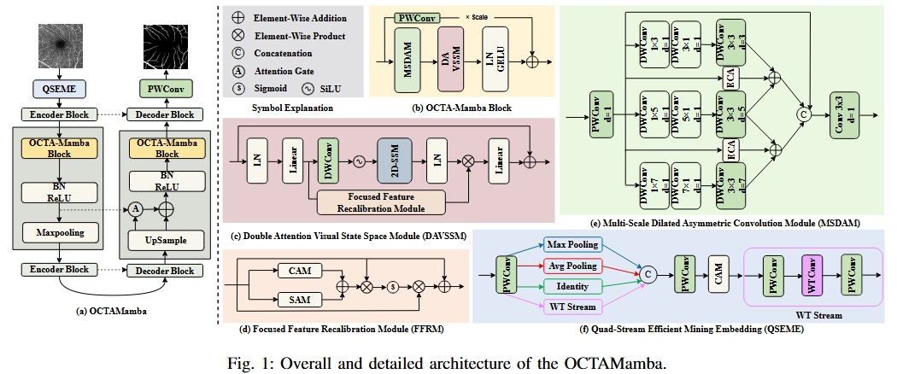
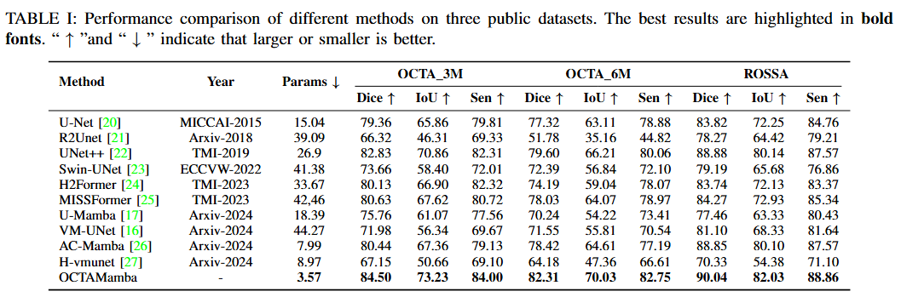
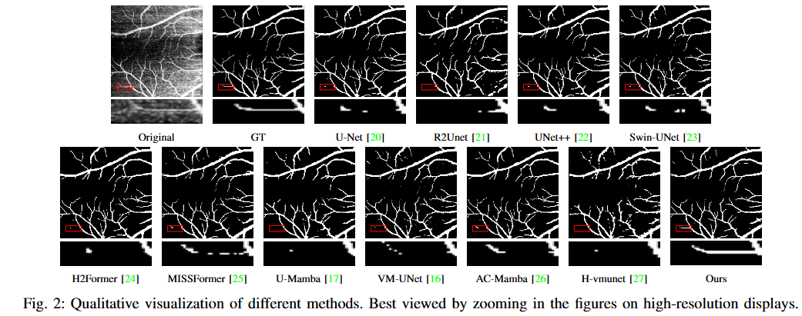

<div align="center">

<h3>OCTAMamba</h3>

[[`Paper`](https://arxiv.org/abs/2409.08000)] 
[[`Project Page`]()]

</div>

## Abstract
Optical Coherence Tomography Angiography (OCTA) is a crucial imaging technique for visualizing retinal vasculature and diagnosing eye diseases such as diabetic retinopathy and glaucoma. However, precise segmentation of OCTA vasculature remains challenging due to the multi-scale vessel structures and noise from poor image quality and eye lesions. In this study, we proposed OCTAMamba, a novel U-shaped network based on the Mamba architecture, designed to segment vasculature in OCTA accurately. OCTAMamba integrates a Quad Stream Efficient Mining Embedding Module for local feature extraction, a Multi-Scale Dilated Asymmetric Convolution Module to capture multi-scale vasculature, and a Focused Feature Recalibration Module to filter noise and highlight target areas. Our method achieves efficient global modeling and local feature extraction while maintaining linear complexity, making it suitable for low-computation medical applications. Extensive experiments on the OCTA 3M, OCTA 6M, and ROSSA datasets demonstrated that OCTAMamba outperforms state-of-the-art methods, providing a new reference for efficient OCTA segmentation. Code is available at https://github.com/zs1314/OCTAMamba
## Overview
<p align="center">
  
</p>

## Quantitative results
<div align="center">

</div>

## Qualitative visualization 
<div align="center">

</div>

---

## 💎Let's Get Started!

### `A. Installation`

Note that the code in this repo runs under **Linux** system. We have not tested whether it works under other OS.

The repo is based on the [VMama repo](https://github.com/MzeroMiko/VMamba), thus you need to install it first. The following installation sequence is taken from the VMamba repo. 

**Step 1: Clone the repository:**

Clone this repository and navigate to the project directory:

```bash
git clone https://github.com/zs1314/OCTAMamba.git
cd OCTAMamba
```


**Step 2: Environment Setup:**

It is recommended to set up a conda environment and installing dependencies via pip. Use the following commands to set up your environment:

***Create and activate a new conda environment***

```bash
conda create -n octamamba
conda activate octamamba
```

***Install dependencies***

```bash
pip install -r requirements.txt
cd kernels/selective_scan && pip install .
```

### `B. Data Preparation`

If you want to run your own dataset, you can configure it in `datasets.py`, in function `prepareDatasets`:
```
def prepareDatasets():
    all_datasets = {}
    
    // Add your datasets here
    // ......

    return all_datasets
```
Note that your dataset should follow the given structure:
```
--root
    --dataset
        |
        |--Your Dataset
            |
            |--train
            |--val
            |--test
```
where each folder in `train`, `val`, `test` should follow the given format:( take `train` as an example)
```
--train
    |
    |--image
    |    |
    |    |--......(images)
    |    |--......
    |    |.......
    |--label
        |
        |--......(labels)
        |--......
        |......
```

The OCTA500_3M, OCTA500_6M and ROSSA datasets are formatted as follows:

```
--root
    --dataset
        |
        |--OCTA500_3M
            |
            |--train
            |    |
            |    |--image
            |    |    |--......(images)
            |    |    |--......
            |    |    |.......
            |    |--label
            |        |--......(labels)
            |        |--......
            |        |......
            |--val
            |--test
        |--OCTA500_6M
        |--ROSSA
```

You can download the dataset from here: [Baidu Netdisk](https://pan.baidu.com/s/1OXn_aD9eri4Rpzrh5yp87Q?pwd=ogao) or [Google Drive](https://drive.google.com/file/d/197RANgHvObtvSbqkGVwuZsm1sc19QT7N/view?usp=drive_link)

###  `C. Model Training and Testing`

If you want to run your own model, please modify the `models` variable in `settings_benchmark.py`:

```
models = {
    # More models can be added here......
}
```
Each item in `models` must be of type `ObjectCreator`, in which your model can be created.

The current version of the code contains 11 models, and 3 datasets: `ROSSA`, `OCTA_500 (3M)` and `OCTA_500 (6M)`.

By running `run_benchmark.py`, the 11 models on 3 datasets will be trained and evaluated at once (that is, a total of 11x3=33 results).

The results will be saved in `json` format to the `result` folder.

```bash
python run_benchmark.py
```

🐥: Before training and testing, configure the relevant parameters in the script

###  `D. Get model weights`
You can download the model weights (OCTAMamba) from here: [Baidu Netdisk](https://pan.baidu.com/s/1Ck1jSQU-m61LU-R253llRA?pwd=un3f) or [Google Drive](https://drive.google.com/file/d/1vrouJ9TKi_Dyj0ZWP0D-upRLFWB45Ryg/view?usp=drive_link)

###  `E. Model Predict`
```bash
python predict.py
```

## 🤝Acknowledgments

This project is based on VMamba ([paper](https://arxiv.org/abs/2401.10166), [code](https://github.com/MzeroMiko/VMamba)). Thanks for their excellent works!!

## 🙋Q & A

***For any questions, please feel free to [contact us.](zs@stu.njau.edu.cn)***

## 📜Reference

If this code or paper contributes to your research, please kindly consider citing our paper and give this repo ⭐️ 🌝

```
@article{zou2024octamamba,
  title={OCTAMamba: A State-Space Model Approach for Precision OCTA Vasculature Segmentation},
  author={Zou, Shun and Zhang, Zhuo and Gao, Guangwei},
  journal={arXiv preprint arXiv:2409.08000},
  year={2024}
}
```


